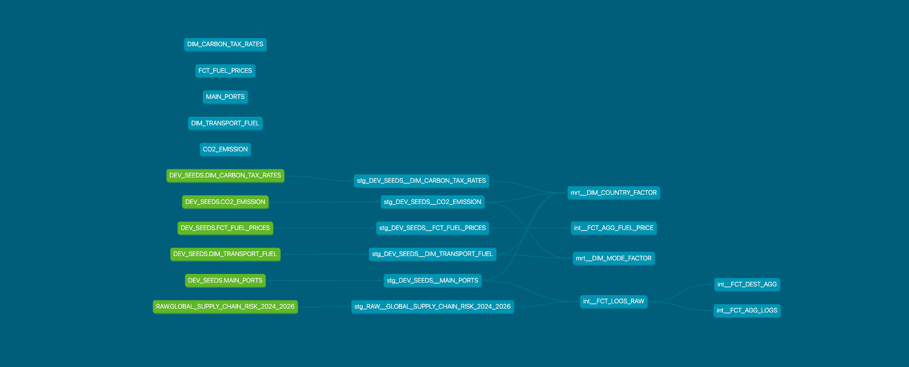

# Logistics Freight Cost & Carbon Emission Optimizer (dbt Part)

## 1. Project Overview & Business Objective
This repository contains the dbt data transformation pipeline designed to power a Global Logistics Cost & Carbon Surcharges Simulator. It works in tandem with Snowflake and Streamlit to enable data-driven logistics decisions.

### Data Source
- Dataset: [Global Supply Chain Risk & Logistics (2024-2026)](https://www.kaggle.com/datasets/nudratabbas/global-supply-chain-risk-and-logistics-2024-2026)

### Purpose
In global logistics, managing the trade-offs between transportation costs, geopolitical risks, and environmental impacts (such as Scope 3 carbon emissions) is critical. This pipeline transforms raw transactional shipment logs into high-performance business marts, allowing users to estimate total transportation costs, carbon tax penalties, and route delay probabilities dynamically. 
Additionally, this project includes a dedicated view to monitor Snowflake warehouse credit consumption for cost transparency.

### Project Description
The data pipeline is architected using dbt Core and Snowflake, following the Modern Data Stack (MDS) best practices. Models are decoupled into a structured 3-layer modular architecture to form a reliable Star-Schema, enabling flexible downstream analytics via Streamlit and traditional BI tools (Tableau, PowerBI, etc.).

* **3-Layer Architecture:**
    * **Staging Layer**: Ingests raw source data, enforces explicit data type casting, applies column renaming/standardization, and basic cleansing.
    * **Intermediate Layer**: Handles complex business logic transformations, metric calculations (e.g., baseline cost and carbon tax rates), and granular dimensions/fact construction.
    * **Mart Layer**: Pushes down fully materialized tables optimized for analytical users, end-user applications, and rapid querying.

## 2. Data Architecture & DAG Lineage
dbt seeds are utilized to maintain static master tables within Snowflake, such as carbon tax coefficients and transport mode baseline costs, ensuring full reproducibility.

## 3. Analytics Engineering Highlights
### Ensuring Idempotency & Performance
To maximize performance and optimize DWH computational costs, heavy transformations are decoupled into multiple staging and intermediate views before being materialized as tables in the Mart layer. By leveraging Snowflake's multi-cluster compute pushdown via dbt, the pipeline ensures strict process idempotency and minimizes production runtime.

## 4. Data Quality Governance (Testing & Documentation)
### Generic Tests
Every model is configured with automated schema tests to enforce data integrity at its specific grain. Utilizing standard constraints and `dbt-utils`, the pipeline continuously validates fields for:
* `unique` and `not_null` properties on primary/surrogate keys.
* `relationships` (referential integrity) between transactional facts and master dimensions.

### Singular Tests
Custom singular data tests are implemented to validate advanced business logic constraints that generic tests cannot catch alone (e.g., verifying that aggregated route costs match calculated baseline metrics and ensuring zero unintended row-multiplication/fan-out during master table joins). This strict validation guarantees that downstream simulator inputs are 100% accurate and trustworthy.